<!-- Please do not change this logo with link -->
[](https://www.microchip.com)

# Blink with Timer

This example shows how to configure an LED to blink periodically using drivers in MPLAB Code Configurator (MCC). The example uses the Pin Manager to configure the pin and generate an API with which the pin is later interfaced. Also, the timer driver is used to implement periodic interrupt between each time the pin output is toggled.

## Related Documentation

- [MPLAB Code Configurator](https://www.microchip.com/en-us/development-tools-tools-and-software/embedded-software-center/mplab-code-configurator)
- [PIC18F57Q47 Data Sheet](https://ww1.microchip.com/downloads/en/DeviceDoc/PIC18F27-47-57Q43-Data-Sheet-DS40002147E.pdf)
- [PIC18F57Q47 Family Product Page](https://www.microchip.com/wwwproducts/en/PIC18F57Q43)

## Software Used

- [MPLAB® X IDE](http://www.microchip.com/mplab/mplab-x-ide) **5.45** or newer
- [MPLAB® XC8](http://www.microchip.com/mplab/compilers) **2.31** or a newer compiler 
- [MPLAB® Code Configurator (MCC)](https://www.microchip.com/mplab/mplab-code-configurator) **4.1.0** or newer 
- [MPLAB® Melody Library](https://www.microchip.com/en-us/development-tools-tools-and-software/embedded-software-center/mplab-code-configurator) **1.37.25** or newer
- [Microchip PIC18F-Q Series Device Support pack](https://packs.download.microchip.com/) **1.9.175** or newer Device Pack

## Hardware Used
- [Microchip PIC18F47Q57 Curiosity Nano Evaluation Kit](https://www.microchip.com/Developmenttools/ProductDetails/DM164150)

## Setup
MCC with Melody library was used to implement this example as shown in the following sections.

### Timer Driver
The Timer Driver was simply added to the project by locating it in the Device Resources pane on the left side in MCC. Within the Drivers menu (expand if needed, red box in image below)timer menu (expand if needed, green box in image below), click on the green plus next to where it says TMR0 (blue box in image below)

*Device Resources*

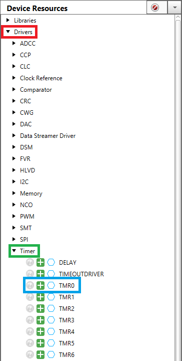


When the Timer Driver was added, it was shown in the Project Resources and in the Builder view as seen below.

*Project Resources - TMR0*


*Builder*

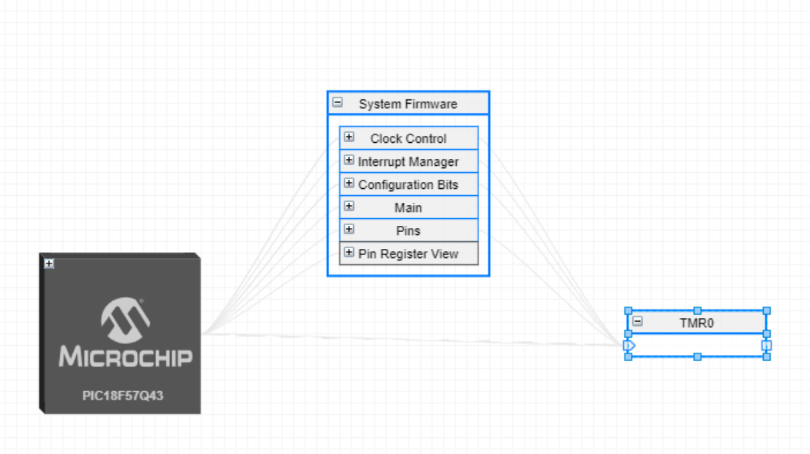


### Timer Configuration
The Timer needs to be configured properly in order to have the code work properly.  There are a few possibilities of what you will see on your screen.  Feel free to skip ahead to the image that matches what you see on your screen.

There should be a tab on the right side that says "TMR0", click it (red box, see image below).

*TMR0 tab is vertical on the right*

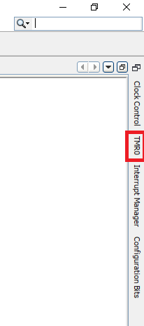


Next click on the little black solid circle in the upper right of the screen (red box, see image below).

*TMR0 tab is selected, menu is behind builder tab*

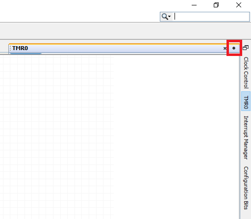


Now, the correct settings are selected in the configuration window.  The **Clock Prescaler** needs to change to 1:1024 (this will change the upper and lower bounds of the **Requested Period(s)** section).  The **Clock Source** needs to change to FOSC/4.  The **Requested Period(s)** needs to change to 0.5 (this value represents the time between blinks, this number can be changed to any value within the provided bounds).  Lastly, the **TMR Interrupt** is enabled (blue switch background).  The changes are highlighted by the red boxesn (see image below).

*TMR0 Configuration tab*

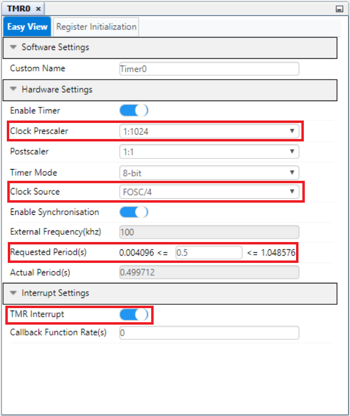


### Interrupt Configuration
Just like the Timer Configuration skip ahead to the image that matches what you see on screen.

Click on the vertical Interrupt Manager tab on the right side (red box, see image below).

*Interrupt Manager tab is vertical on the right*

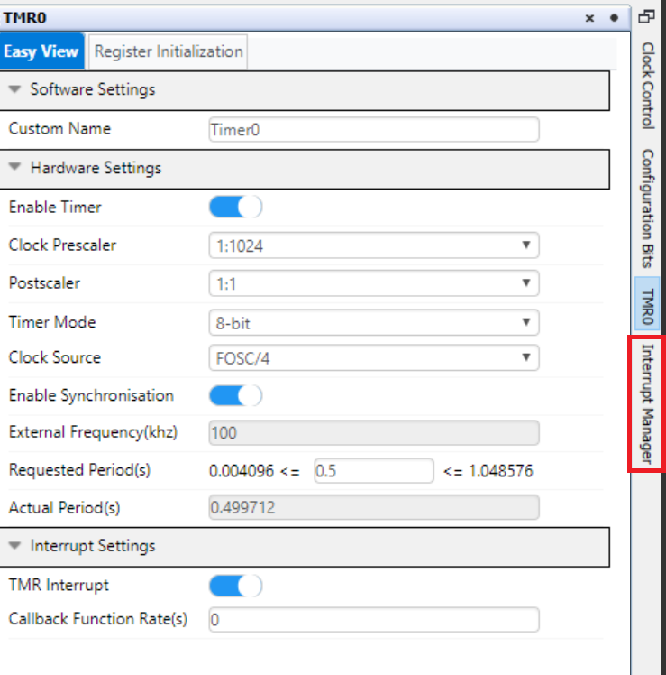

NOTE: You may have the tab on the right in a different order

Now click on the little black solid circle in the upper right of the screen (red box, see image below).

*Interrupt Manager tab is selected, menu is behind TMR0 tab*

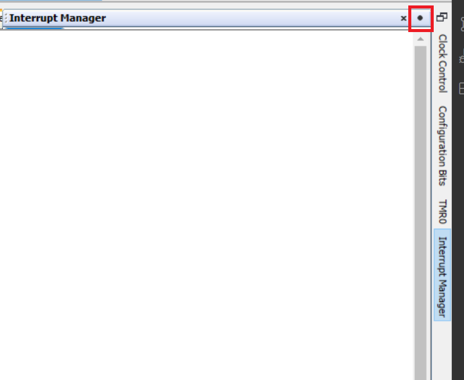


Now, the correct settings are selected in the configuration window.  There should not be any needed changes (see image below).

*Interrupt Manager tab*

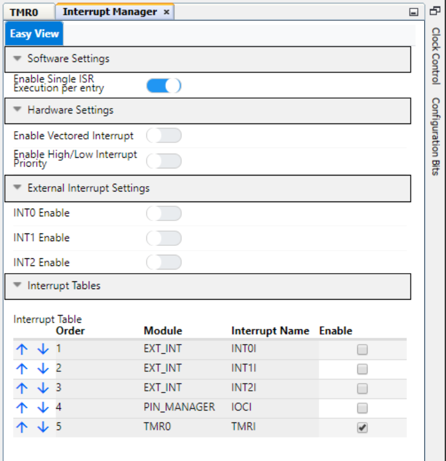


### Pin Configuration
The Pin controlling the onboard LED on the Curiosity Nano board was configured using the Pins Grid View.  The Pins Grid View is accessed by clicking on the Pins line in Project Resources.

*Project Resources - Pins*

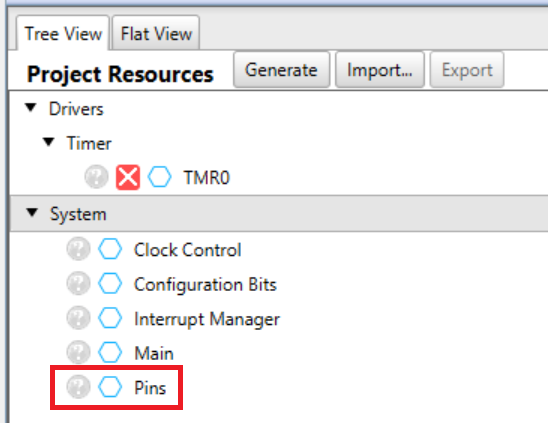


Then the pin connected to the LED, RF3, was selected as an output by clicking the corresponding padlock symbol (red box, see image below).

*Pins Grid View*

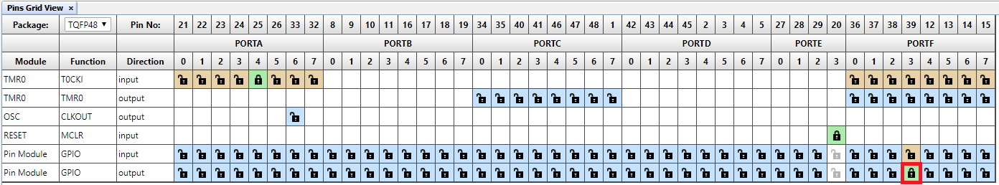


The pin was also configured with a custom name to make the generated API more readable.  No other pin setting were modified.

*Custom Pin Name*

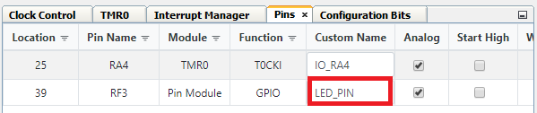


### Code Implementation
Click Generate within the Project Resources Menu.

*Generate the code*

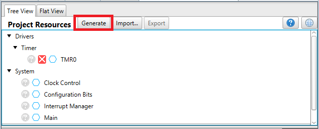


First, the code needs an additional function to operate correctly.  This function uses the pin manager API to toggle the LED on and off.

```c
void LED_PIN_ISR(void){ 
    LED_PIN_Toggle();
    }
```
Then the pin manager and timer interrupt APIs were used to set the LED pin High (turns it off), and start a toggle sequence once the timer overflow interrupt is triggered.

```c
int main(void)
{
    SYSTEM_Initialize();
    LED_PIN_LAT = HIGH; //Turns LED off before running rest of code
    while(1)
    {
        INTERRUPT_GlobalInterruptEnable(); //turn on interrupts
        //When the registers TMR0L/H overflow, the function 'LED_PIN_ISR' gets executed
        Timer0_OverflowCallbackRegister(LED_PIN_ISR); 
        INTERRUPT_GlobalInterruptDisable(); //turn off interrupts
    }    
}
```
## Operation
After having flashed the application to the PIC18F57Q47 Curiosity Nano, the onboard LED is blinking on and off.

## Summary

The example has shown how MCC can be used to configure the pins of the PIC18F57Q47 device.
